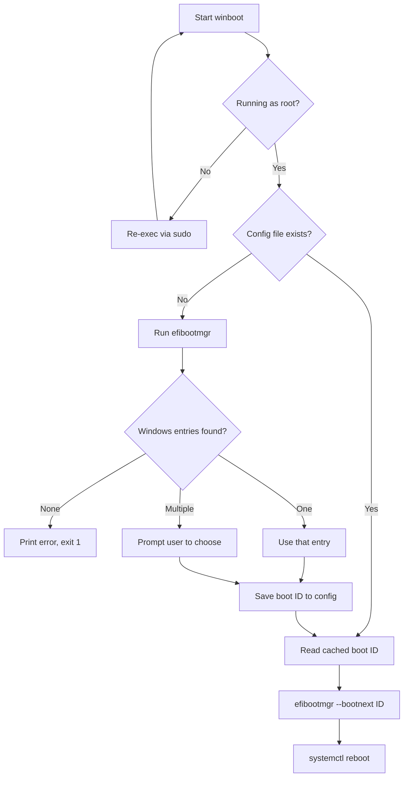

# Architecture

`winboot` is a single Bash script (`winboot.sh`) with no runtime dependencies
beyond `efibootmgr` and `systemctl`. It relies on the UEFI `BootNext` variable,
which tells the firmware to boot a specific entry exactly once on the next boot.
Because `BootNext` is one-time, the default boot order is never modified.

## Boot flow

## Key steps

1. **Privilege check.** If not run as root, the script re-executes itself with
   `sudo`, preserving arguments. Reading and writing UEFI variables requires root.
2. **Config lookup.** If `$WINBOOT_CONFIG` (default `/etc/winboot.conf`) is a
   non-empty file, its contents are used as the boot entry ID and the scan is
   skipped.
3. **Entry discovery.** On first run, `efibootmgr` output is parsed with `awk` to
   extract lines containing "Windows Boot Manager". The four-digit ID is pulled
   from each `BootXXXX` token.
4. **Selection.** Zero entries is a fatal error. One entry is used directly.
   Multiple entries trigger an interactive `select` prompt.
5. **Persist.** The chosen ID is written to the config file for future runs.
6. **Set and reboot.** `efibootmgr --bootnext <id>` sets the one-time target, then
   `systemctl reboot` restarts the machine.

## Error handling

The script runs under `set -euo pipefail`, so unset variables and failed commands
abort execution. A failed `efibootmgr` read prints a clear message and exits
before any reboot is attempted. No config file is written on error paths.

## Testing

`winboot_test.sh` runs the script against stubbed `efibootmgr`, `systemctl`, `id`,
and `sudo` binaries injected on `PATH`. It records the commands the script would
run into a log file and asserts on that log, so the tests never touch real UEFI
firmware or reboot the host. See [Testing](features/testing.md).
