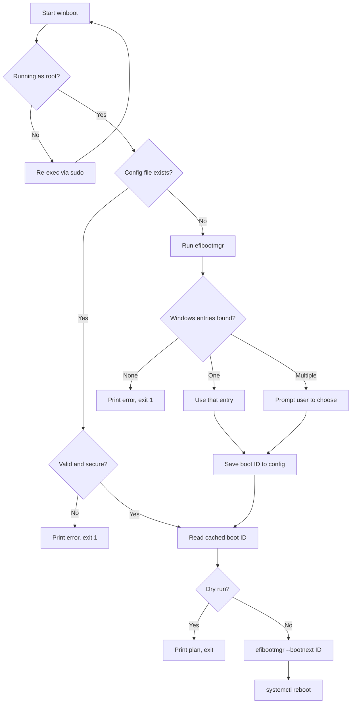

# Architecture

`winboot` is a single Bash script (`winboot.sh`) with no runtime dependencies
beyond `efibootmgr` and `systemctl`. It relies on the UEFI `BootNext` variable,
which tells the firmware to boot a specific entry exactly once on the next boot.
Because `BootNext` is one-time, the default boot order is never modified.

## Boot flow

## Key steps

1. **Privilege check.** If not run as root, the script re-executes itself with
   `/usr/bin/sudo`, preserving arguments. Reading and writing UEFI variables
   requires root.
2. **Config lookup.** If `/etc/winboot.conf` is a non-empty regular file (not a
   symlink, not group/world-writable) with a four-digit hex boot ID, that ID is
   used and the scan is skipped.
3. **Entry discovery.** On first run, `efibootmgr` output is parsed for entries
   labeled "Windows Boot Manager" whose device path includes
   `\EFI\Microsoft\Boot\bootmgfw.efi`. If none match, the script falls back to
   label-only matches with a warning.
4. **Selection.** Zero entries is a fatal error. One entry is used directly.
   Multiple entries trigger an interactive `select` prompt.
5. **Persist.** The chosen ID is written atomically to `/etc/winboot.conf` mode
   `0644` (skipped under `--dry-run`).
6. **Set and reboot.** Unless `--dry-run`, `efibootmgr --bootnext <id>` sets the
   one-time target, then `systemctl reboot` restarts the machine.

Helpers are invoked via absolute paths (`/usr/bin/efibootmgr`,
`/usr/bin/systemctl`, `/usr/bin/id`, `/usr/bin/sudo`) so a hostile `PATH` cannot
redirect them.

## Error handling

The script runs under `set -euo pipefail`, so unset variables and failed commands
abort execution. A failed `efibootmgr` read prints a clear message and exits
before any reboot is attempted. No config file is written on error paths.
Insecure or invalid config files are refused rather than trusted.

## Testing

`winboot_test.sh` rewrites absolute paths in a temp copy of the script to point
at stubbed `efibootmgr`, `systemctl`, `id`, and `sudo` binaries. It records the
commands the script would run into a log file and asserts on that log, so the
tests never touch real UEFI firmware or reboot the host. See
[Testing](features/testing.md).
